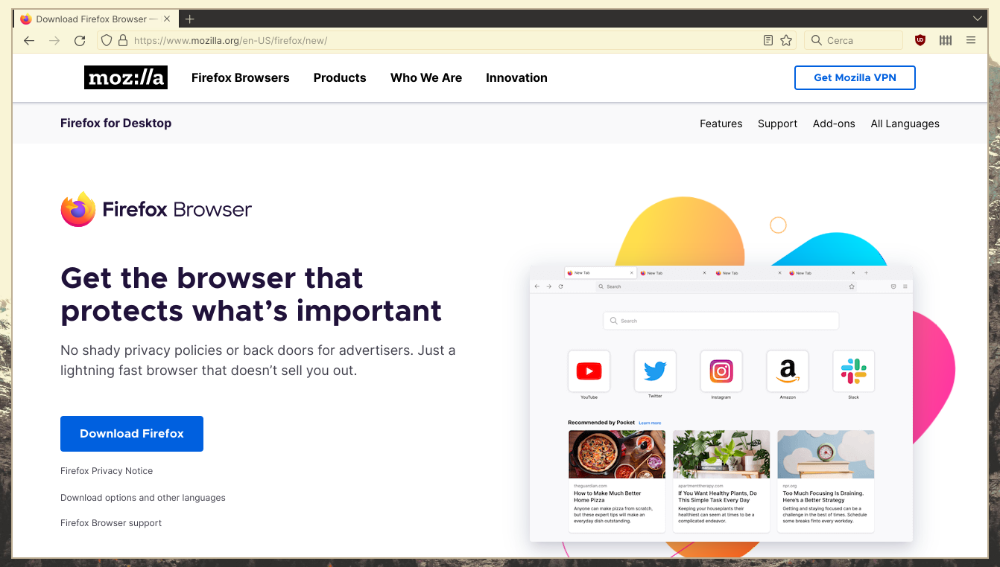
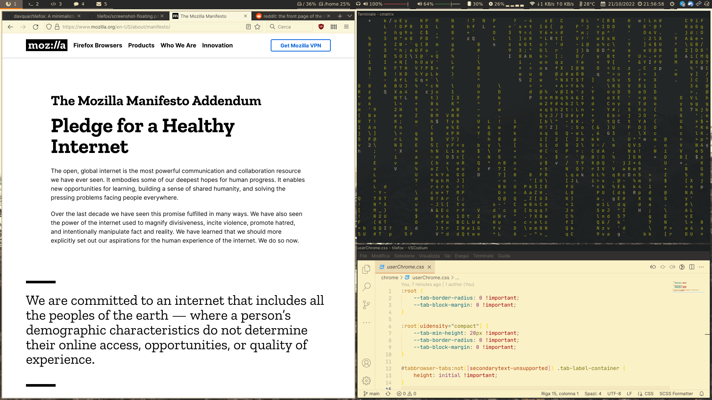

# TileFox

TileFox is a minimalistic **userChrome.css** theme for Mozilla Firefox, that:

* Integrates well with **tiling window managers**.
* Respects the system's **GTK+ theme**.

_Screenshots made with [i3-gaps](https://github.com/Airblader/i3) as WM and [Gruvbox GTK](https://github.com/Fausto-Korpsvart/Gruvbox-GTK-Theme) theme._

## Installation

Just download [`userChrome.css`](chrome/userChrome.css) in your `$HOME/.mozilla/firefox/<profile>/chrome/`.

## Keyboard shortcuts

Since if you install this theme you are probably using a tiling window manager, here we have some useful keyboard shortcuts that Firefox supports:

| Shortcut         | Action           |
| ---------------- | ---------------- |
| `Ctrl`+`Q`       | Close Firefox    |
| `Ctrl`+`R`       | Refresh          |
| `Ctrl`+`T`       | New tab          |
| `Ctrl`+`W`       | Close tab        |
| `Ctrl`+`Alt`+`T` | Reopen tab       |
| `Ctrl`+`PgUp`    | Previous tab     |
| `Ctrl`+`PgDn`    | Next tab         |
| `Alt`+`Left`     | Go back          |
| `Alt`+`Right`    | Go forward       |
| `Ctrl`+`K`       | Focus URL bar    |
| `Ctrl`+`L`       | Focus search bar |